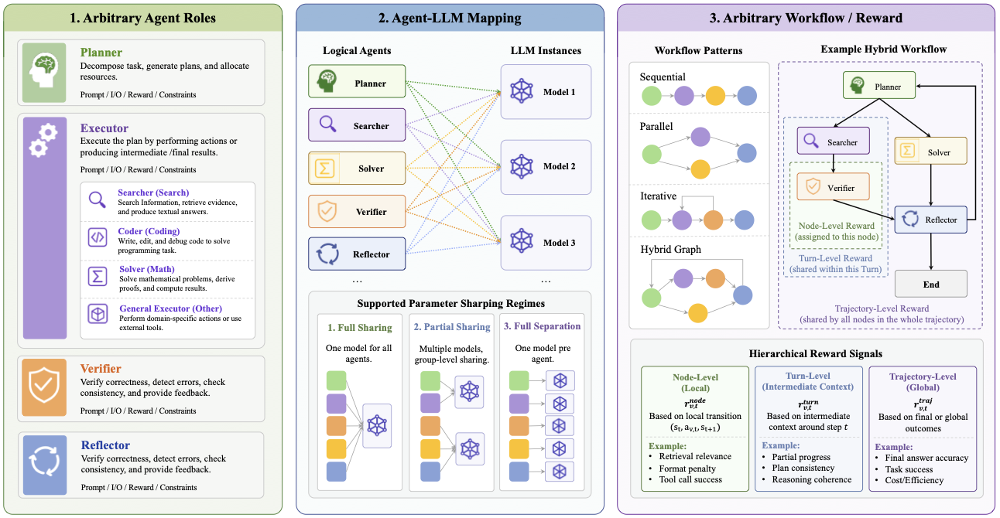
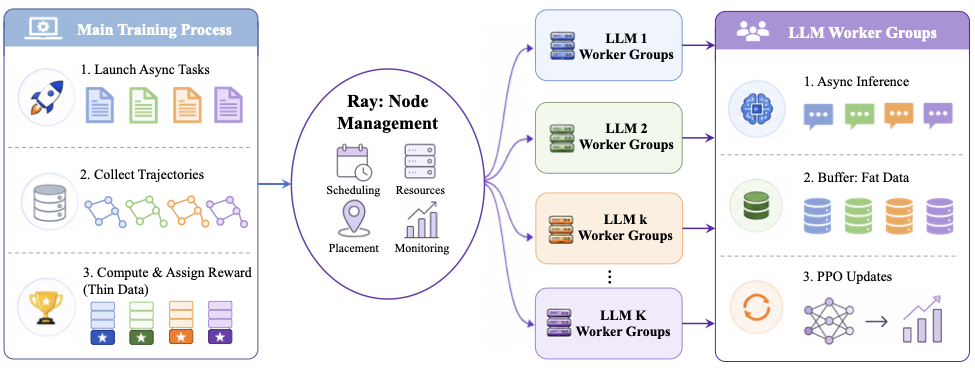
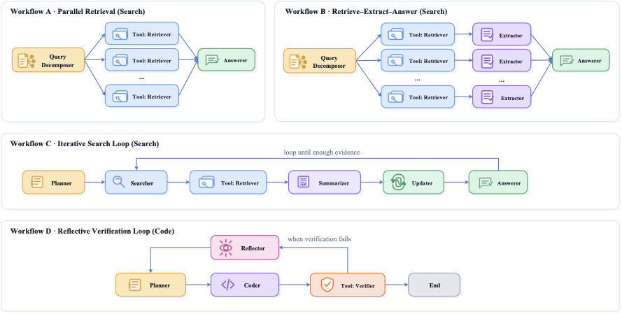
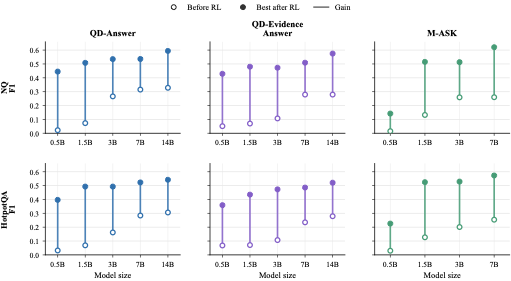
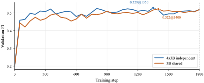
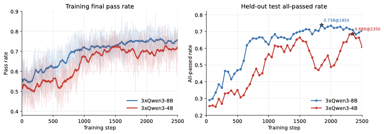
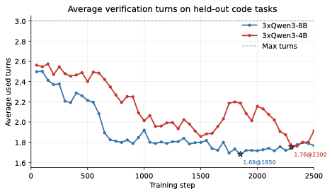

# UnityMAS-O

Chinese version: [README.zh.md](README.zh.md)

UnityMAS-O is an LLM multi-agent reinforcement learning optimization framework adapted from [verl](https://github.com/verl-project/verl). It extends conventional single-policy RL post-training into configurable multi-agent workflows: users define logical agents, workflow execution graphs, mappings from agents to physical LLMs, and reward allocation rules over nodes, turns, or full trajectories. The framework executes workflows asynchronously, collects structured traces, assigns rewards back to the corresponding agents, and updates each physical LLM through a PPO-style training pipeline.

The repository still keeps the upstream Verl training stack. UnityMAS-O specific code mainly lives in `verl/experimental/star_ppo/` and `examples/star_ppo/`.

<a href="docs/assets/unitymas-o/unity-framework.pdf">
  
</a>

## Core Idea

UnityMAS-O does not train only a final answer model. It optimizes the whole LLM-based multi-agent system. A task instance is expanded into a multi-step structured trajectory, for example:

```text
QA/search:  plan -> search -> retrieve(tool) -> summarize -> update -> answer
code:       planner -> coder -> verifier(tool) -> reflector -> planner -> ...
math:       solver -> verifier -> refiner -> finalizer
```

The framework makes four objects explicit:

- **Logical agents**: roles in a workflow, such as planner, searcher, summarizer, coder, reflector, and answerer.
- **Agent-LLM mapping**: the mapping from logical agents to physical models. Agents can fully share one model, use fully separate models, or use partially shared model groups.
- **Workflow trace**: the structured execution record for each sample, including agent outputs, tool results, state updates, control flow, and debug information.
- **Reward allocator**: the component that assigns final metrics, local format rewards, turn-level gains, or tool feedback back to concrete agent invocations.

This design lets the same workflow train under different parameter-sharing schemes. For example, M-ASK can train with four independent model groups, or map all roles to one `shared_agent_llm`; the code workflow can train planner, coder, and reflector with three separate model groups, or switch to a shared LLM configuration.

## System Architecture

<a href="docs/assets/unitymas-o/system.pdf">
  
</a>

Runtime execution follows a Ray star topology:

- A central controller schedules workflows, calls tools, manages state transitions, assembles rewards, and coordinates training.
- Each physical LLM has a model-local worker group for rollout, fat tensor caching, ready-batch construction, advantage/logprob/value computation, and PPO updates.
- The controller sends only lightweight action/output/metadata records. Large tensors stay inside the worker group that produced them, reducing cross-node communication.
- `phi: logical agent -> model_id` determines which physical model training buffer receives each reward and rollout record.

## Code Layout

```text
verl/experimental/star_ppo/
  main_ppo.py                         # UnityMAS-O / STAR PPO entry point
  ray_trainer.py                      # multi-engine Ray trainer, workflow execution, reward commit, PPO update
  star_fsdp_workers.py                # detached actor / async rollout / critic / reward worker
  trajectory_buffer.py                # model-local trajectory buffer
  types.py                            # basic types such as engine specs

  config/                             # Hydra configs
    star_ppo_trainer.yaml             # shared STAR PPO base config
    star_code_iterative_plan_code_reflect_trainer.yaml
    star_code_iterative_plan_code_reflect_shared_llm_trainer.yaml
    star_iterative_plan_search_summary_update_answer_f1_trainer.yaml
    star_iterative_plan_search_summary_update_answer_f1_shared_llm_trainer.yaml
    star_math_solver_verifier_refiner_finalizer_*.yaml
    star_query_decompose_retrieve*_trainer.yaml

  workflows/                          # workflow runner plugins
    base.py                           # WorkflowRunner interface
    schema.py                         # WorkflowTrace / WorkflowExecutionRecord / RewardAssignment
    mask_iterative_workflow.py        # M-ASK iterative search workflow
    code_iterative_workflow.py        # plan-code-reflect code workflow
    math_multi_agent_workflow.py      # math multi-agent workflow
    graph_workflow.py                 # graph-style workflow support

  reward_allocators/                  # reward allocation plugins
    base.py
    mask_turn_level.py
    code_turn_level.py
    math_final_answer.py

  tools/                              # tool interfaces
    retriever.py                      # retrieval API pool
    code_verifier.py                  # local code execution/verifier
    math_answer.py
    prompt_builders.py

  datasets/
    code_jsonl_dataset.py             # code JSON/JSONL/Parquet adapter
    math_jsonl_dataset.py             # math JSON/JSONL/Parquet adapter

examples/star_ppo/
  common/
    run_per_node.sh                   # start Ray head/worker on each node, launch training on rank 0
    run_per_node_background.sh        # background launcher, logs go to logs/star_ppo/
    run_ip_list.sh                    # launch by IP list
    launch_ip_list_background.sh
    launch_kubectl_exec_background.sh
  code_iterative_workflow/README.md
  mask_iterative_workflow/README.md
  math_multi_agent/README.md
```

## Environment Setup

Start from a clean `verl` conda environment. The experiments were run with the following setup:

```bash
cd /path/to/UnityMAS-O

# Create a Python 3.10 environment. The printf prefix answers conda's interactive prompts.
printf 'a\na\nyes\n' | conda create -n verl python=3.10
conda activate verl

# Install vLLM / SGLang / Megatron-Core related dependencies.
bash scripts/install_vllm_sglang_mcore_0.7.sh

# Install this repository in editable mode, so code changes take effect directly.
pip install --no-deps -e .

# Pin versions. numpy 2.x and different Transformers/TRL versions may break Verl/vLLM compatibility.
pip install "numpy<2.0"
pip uninstall transformers -y
pip install transformers==4.57 --no-cache-dir
pip uninstall -y trl
pip install "trl==0.26.2"

# Optional: remote debugging.
pip install debugpy==1.8.0
```

The environment mainly depends on Verl, PyTorch, Ray, vLLM/SGLang, Transformers, Hydra/OmegaConf, and datasets. If the cluster image already contains part of the stack, still check the versions of `numpy`, `transformers`, and `trl`; many compatibility issues come from these packages.

Before launching a run, it is usually helpful to clean old Ray processes and Python workers:

```bash
ray stop --force >/dev/null 2>&1 || true
pkill -9 -f "/miniconda3/envs/verl/bin/python3.10" || true
```

If you use wandb, pass credentials through environment variables. Do not write keys into scripts or config files:

```bash
export WANDB_API_KEY="<your-wandb-api-key>"
export WANDB_ENTITY="<your-wandb-entity>"
```

## Private Runtime Variables

Configs and scripts should not hard-code personal paths, wandb keys, or internal cluster addresses. Before running experiments, set the following variables in the launch environment on every node:

```bash
# Personal or cluster storage root. The original private storage root has been replaced by this placeholder.
export UNITYMAS_ROOT="/path/to/your/storage/root"

# Ray head node address. All nodes must use the same HEAD_IP; only RANK changes.
export HEAD_IP="<ray-head-ip>"

# wandb. Leave unset if you do not use wandb.
export WANDB_API_KEY="<your-wandb-api-key>"
export WANDB_ENTITY="<your-wandb-entity>"

# Retriever endpoint pool required by RAG/search workflows.
export RETRIEVAL_API_URLS_JSON='["http://retriever.example.com:8000/retrieve"]'

# Optional: set only if your cluster needs a proxy for external network access.
export PROXY_URL="proxy.example.com:3128"
```

`UNITYMAS_ROOT` is used to build default paths for data, models, repositories, and installation scripts. `HEAD_IP`, `RETRIEVAL_API_URLS_JSON`, and `PROXY_URL` are cluster-specific and usually need to be reset when moving to a new environment. Do not commit real values to the repository.

## Multi-Node Launch

The common launcher is `examples/star_ppo/common/run_per_node_background.sh`. Run it once on each node:

- `HEAD_IP`: IP address of the rank 0 node. It must be the same on all nodes.
- `WORLD_SIZE`: total number of nodes.
- `RANK`: current node rank. The head node is `0`; other nodes are `1..WORLD_SIZE-1`.
- `CONFIG_NAME`: workflow config name.
- Other environment variables specify models, data, batch sizes, rollout settings, timeouts, and debug switches.

Rank 0 starts the Ray head, waits for all nodes to join, and then launches training. Non-zero ranks start Ray workers and block.

Minimal head-node command. Every node should set `UNITYMAS_ROOT` first; if you use wandb, set `WANDB_API_KEY` and `WANDB_ENTITY` here as well:

```bash
export UNITYMAS_ROOT="/path/to/your/storage/root"
export HEAD_IP="<ray-head-ip>"
export WANDB_API_KEY="<your-wandb-api-key>"
export WANDB_ENTITY="<your-wandb-entity>"

RANK=0 HEAD_IP="${HEAD_IP}" WORLD_SIZE=4 \
CONFIG_NAME=star_iterative_plan_search_summary_update_answer_f1_trainer \
bash examples/star_ppo/common/run_per_node_background.sh
```

Worker node:

```bash
export UNITYMAS_ROOT="/path/to/your/storage/root"
export HEAD_IP="<ray-head-ip>"
export WANDB_API_KEY="<your-wandb-api-key>"
export WANDB_ENTITY="<your-wandb-entity>"

RANK=1 HEAD_IP="${HEAD_IP}" WORLD_SIZE=4 \
CONFIG_NAME=star_iterative_plan_search_summary_update_answer_f1_trainer \
bash examples/star_ppo/common/run_per_node_background.sh
```

Logs are written to:

```text
logs/star_ppo/run_rank<rank>_<timestamp>.log
```

## Main Workflows

<a href="docs/assets/unitymas-o/workflow.pdf">
  
</a>

| Workflow | Config | Logical agents | Typical reward |
| --- | --- | --- | --- |
| Reflective Code | `star_code_iterative_plan_code_reflect_trainer` | planner, coder, reflector; verifier is a tool | verifier pass score at turn 0, pass-score delta for later turns, plus format reward |
| Reflective Code shared | `star_code_iterative_plan_code_reflect_shared_llm_trainer` | planner/coder/reflector share one physical LLM | same as above |
| M-ASK iterative search | `star_iterative_plan_search_summary_update_answer_f1_trainer` | planning/answer share the reasoning LLM; search/summary/update are separate | planning/answer use absolute F1; search/summary/update use F1 delta |
| M-ASK shared | `star_iterative_plan_search_summary_update_answer_f1_shared_llm_trainer` | all search workflow roles share one physical LLM | same as above |
| Math multi-agent | `star_math_solver_verifier_refiner_finalizer_trainer` | solver, verifier, refiner, finalizer | final-answer accuracy + format reward |
| Query decomposition RAG | `star_query_decompose_retrieve_answer_f1_trainer` and related configs | query decomposer, answerer, optional evidence/summarizer | final-answer F1 + node-level format reward |

## Tasks and Benchmarks

The current repository focuses on verifiable workflows where task rewards can be computed from answer matching, retrieval QA metrics, executable tests, or rule-based graders. The table below separates completed/reported experiments from tasks that are implemented or planned for future expansion.

| Status | Task family | Workflow / setting | Benchmarks or datasets | Main metrics / notes |
| --- | --- | --- | --- | --- |
| Completed / reported | Retrieval-augmented QA | Query Decompose -> Retrieve -> Answer; Query Decompose -> Retrieve -> Evidence -> Answer | Natural Questions (NQ), HotpotQA | Normalized answer F1; before/after multi-agent RL comparison across model scales |
| Completed / reported | Iterative agentic search | M-ASK: Plan -> Search -> Summary -> Update -> Answer; independent and shared-parameter variants | Natural Questions (NQ), HotpotQA | Normalized answer F1; turn-level F1 and F1-delta reward; includes HotpotQA shared vs independent 3B comparison |
| Completed / reported | Reflective code generation | Iterative Plan -> Code -> Verify(tool) -> Reflect, up to three turns | DeepCoder-style verifiable programming tasks; processed train/test split derived from TACO-Verified, PrimeIntellect SYNTHETIC-1, and LiveCodeBench v5 | Executable-test pass rate, held-out all-passed rate, and average verifier turns |
| Implemented / expanding | Math reasoning | Solver -> Verifier -> Refiner -> Finalizer | DeepScaleR-style training data; MATH-500, AIME24, AIME25, AIME26, AMC23 | Final-answer accuracy and format reward; configs/dataset adapters are present, broader experiments are being expanded |
| Planned / ongoing | Embodied-agent tasks | Tool/environment-interaction workflows | ALFWorld | Task success / completion rate; intended to test long-horizon environment interaction |
| Planned / ongoing | Web-interaction tasks | Search/browse/shop interaction workflows | WebShop | WebShop reward or success score; intended to test web action and tool-use credit assignment |
| Planned / ongoing | Software-engineering tasks | Multi-agent issue localization, coding, verification, and repair | SWE-bench | Resolved issue rate / test pass rate; intended to test long-horizon codebase-level workflows |

## Example 1: Reflective Code Generation

This config trains three non-shared LLM agents:

- `planner_agent` -> `planner_llm`
- `coder_agent` -> `coder_llm`
- `reflection_agent` -> `reflection_llm`

The dataset can be JSON, JSONL, or Parquet. Common fields are:

```json
{
  "uid": "example/0",
  "source": "codeforces",
  "problem": "problem statement ...",
  "starter_code": "",
  "tests": "[{\"input\":\"1\\n2 1\",\"output\":\"1 2\"}]"
}
```

Three-node example: run the same command on the three nodes, changing only `RANK` to `0`, `1`, and `2`.

```bash
cd /path/to/UnityMAS-O
conda activate verl
ray stop --force >/dev/null 2>&1 || true
pkill -9 -f "/miniconda3/envs/verl/bin/python3.10" || true

export UNITYMAS_ROOT="/path/to/your/storage/root"
export HEAD_IP="<ray-head-ip>"
export WANDB_API_KEY="<your-wandb-api-key>"
export WANDB_ENTITY="<your-wandb-entity>"

RANK=0 HEAD_IP="${HEAD_IP}" WORLD_SIZE=3 \
CONFIG_NAME=star_code_iterative_plan_code_reflect_trainer \
PROJECT_NAME="STAR-Code" \
EXPERIMENT_NAME="deepcoder_marti_iterative_plan_code_reflect_3xQwen3_4B_no_think_sp4" \
TRAIN_JSONL="${UNITYMAS_ROOT}/datasets/code_datasets/DeepCoder-Preview-Dataset/processed_marti_jsonl/train_shuffled.jsonl" \
VAL_JSONL="${UNITYMAS_ROOT}/datasets/code_datasets/DeepCoder-Preview-Dataset/processed_marti_jsonl/test_shuffled.jsonl" \
AGENT_MODEL_PATH="${UNITYMAS_ROOT}/base_models/Qwen/Qwen3-4B" \
PLANNER_MODEL_PATH="${UNITYMAS_ROOT}/base_models/Qwen/Qwen3-4B" \
CODER_MODEL_PATH="${UNITYMAS_ROOT}/base_models/Qwen/Qwen3-4B" \
REFLECTION_MODEL_PATH="${UNITYMAS_ROOT}/base_models/Qwen/Qwen3-4B" \
ACTOR_MODEL_PATH="${UNITYMAS_ROOT}/base_models/Qwen/Qwen3-4B" \
QWEN_ENABLE_THINKING=false \
GEN_BATCH_SIZE=64 \
VAL_BATCH_SIZE=64 \
VAL_MAX_BATCHES=-1 \
VAL_BEFORE_TRAIN=true \
STAR_MAX_INFLIGHT_QUERIES=64 \
STAR_MAX_PARALLEL_ROLLOUTS_PER_MODEL=64 \
STAR_LLM_MICROBATCH_MAX_SIZE=64 \
STAR_LLM_MICROBATCH_MAX_WAIT_MS=1000 \
ACTOR_PPO_MINI_BATCH_SIZE=64 \
ACTOR_PPO_MICRO_BATCH_SIZE_PER_GPU=1 \
CRITIC_PPO_MICRO_BATCH_SIZE_PER_GPU=1 \
ROLLOUT_LOGPROB_MICRO_BATCH_SIZE_PER_GPU=1 \
REF_LOGPROB_MICRO_BATCH_SIZE_PER_GPU=1 \
ROLLOUT_TENSOR_MODEL_PARALLEL_SIZE=4 \
ROLLOUT_GPU_MEMORY_UTILIZATION=0.40 \
ROLLOUT_PROMPT_LENGTH=8192 \
ROLLOUT_RESPONSE_LENGTH=2048 \
ROLLOUT_MAX_MODEL_LEN=10240 \
ROLLOUT_MAX_NUM_SEQS=64 \
DATA_MAX_PROMPT_LENGTH=8192 \
STAR_PER_INFER_PROMPT_MAX_TOKENS=7680 \
CODE_MAX_TURNS=3 \
CODE_STOP_ON_ALL_PASSED=true \
CODE_VERIFY_TIMEOUT_SECONDS=1.0 \
CODE_VERIFY_DEFAULT_CHECKER_TYPE=auto \
CODE_VERIFY_MAX_TESTS_PER_EXAMPLE=8 \
CODE_VERIFIER_FAIL_OPEN=false \
STAR_QUERY_TIMEOUT_SECONDS=420 \
STAR_WORKFLOW_BATCH_TIMEOUT_SECONDS=900 \
STAR_RAY_GET_TIMEOUT_SECONDS=600 \
STAR_WORKER_CALL_TIMEOUT_SECONDS=600 \
STAR_LLM_TIMEOUT_SECONDS=900 \
STAR_VAL_PROGRESS_EVERY=1 \
STAR_WORKFLOW_DEBUG=true \
STAR_WORKFLOW_DEBUG_EVERY_N_BATCHES=10 \
STAR_WORKFLOW_DEBUG_SAMPLE_INDEX=0 \
STAR_WORKFLOW_DEBUG_MAX_CHARS=4000 \
STAR_VAL_DEBUG=true \
STAR_VAL_DEBUG_MAX_CHARS=4000 \
STAR_TOOL_TIMEOUT_SECONDS=0 \
bash examples/star_ppo/common/run_per_node_background.sh \
  actor_rollout_ref.model.use_remove_padding=true \
  critic.model.use_remove_padding=true \
  actor_rollout_ref.actor.ulysses_sequence_parallel_size=4 \
  actor_rollout_ref.actor.fsdp_config.ulysses_sequence_parallel_size=4 \
  actor_rollout_ref.ref.ulysses_sequence_parallel_size=4 \
  actor_rollout_ref.ref.fsdp_config.ulysses_sequence_parallel_size=4 \
  critic.ulysses_sequence_parallel_size=4 \
  critic.model.fsdp_config.ulysses_sequence_parallel_size=4
```

Important switches:

- `CODE_MAX_TURNS`: maximum number of plan-code-verify-reflect turns.
- `CODE_STOP_ON_ALL_PASSED`: stop early once all verifier tests pass.
- `CODE_VERIFY_TIMEOUT_SECONDS`: timeout for one code execution.
- `CODE_VERIFIER_FAIL_OPEN=false`: whether verifier failures should be treated as pass-through. For code training, `false` is usually preferred.
- `STAR_PER_INFER_PROMPT_MAX_TOKENS`: truncation limit for each agent prompt.

## Example 2: M-ASK Iterative Search, Four Model Groups

This config contains five logical agents and four physical LLMs:

- `planning_agent` and `answer_agent` share `reasoning_agent_llm`
- `search_agent` uses a separate LLM
- `summary_agent` uses a separate LLM
- `update_agent` uses a separate LLM

By default, data is read from:

```text
DATASET_ROOT/<DATASET_NAME>/train_verl.parquet
DATASET_ROOT/<DATASET_NAME>/test_verl.parquet
```

You can override this with `TRAIN_PARQUET` and `VAL_PARQUET`.

Four-node example: run the same command on four nodes, changing only `RANK` to `0`, `1`, `2`, and `3`.

```bash
cd /path/to/UnityMAS-O
conda activate verl
ray stop --force >/dev/null 2>&1 || true
pkill -9 -f "/miniconda3/envs/verl/bin/python3.10" || true

export UNITYMAS_ROOT="/path/to/your/storage/root"
export HEAD_IP="<ray-head-ip>"
export WANDB_API_KEY="<your-wandb-api-key>"
export WANDB_ENTITY="<your-wandb-entity>"

RANK=0 HEAD_IP="${HEAD_IP}" WORLD_SIZE=4 \
CONFIG_NAME=star_iterative_plan_search_summary_update_answer_f1_trainer \
DATASET_NAME="hotpotqa" \
STAR_RETRIEVER_RANDOM_ENDPOINT=true \
RETRIEVAL_API_URLS_JSON='["http://retriever-0.example.com:8000/retrieve","http://retriever-1.example.com:8000/retrieve"]' \
PROJECT_NAME="M-ASK" \
EXPERIMENT_NAME="hotpotqa_M-ASK_f1_4x7B" \
REASONING_MODEL_PATH="${UNITYMAS_ROOT}/base_models/Qwen/Qwen2.5-7B-Instruct" \
SEARCH_MODEL_PATH="${UNITYMAS_ROOT}/base_models/Qwen/Qwen2.5-7B-Instruct" \
SUMMARY_MODEL_PATH="${UNITYMAS_ROOT}/base_models/Qwen/Qwen2.5-7B-Instruct" \
UPDATE_MODEL_PATH="${UNITYMAS_ROOT}/base_models/Qwen/Qwen2.5-7B-Instruct" \
GEN_BATCH_SIZE=128 \
STAR_MAX_INFLIGHT_QUERIES=128 \
STAR_MAX_PARALLEL_ROLLOUTS_PER_MODEL=32 \
ACTOR_PPO_MINI_BATCH_SIZE=128 \
ACTOR_PPO_MICRO_BATCH_SIZE_PER_GPU=1 \
CRITIC_PPO_MICRO_BATCH_SIZE_PER_GPU=1 \
ROLLOUT_LOGPROB_MICRO_BATCH_SIZE_PER_GPU=1 \
REF_LOGPROB_MICRO_BATCH_SIZE_PER_GPU=1 \
ROLLOUT_TENSOR_MODEL_PARALLEL_SIZE=1 \
ROLLOUT_GPU_MEMORY_UTILIZATION=0.20 \
MASK_MAX_TURNS=3 \
MASK_STOP_ON_SEARCH_END=true \
STAR_QUERY_TIMEOUT_SECONDS=600 \
STAR_WORKFLOW_BATCH_TIMEOUT_SECONDS=900 \
STAR_RAY_GET_TIMEOUT_SECONDS=300 \
STAR_WORKER_CALL_TIMEOUT_SECONDS=300 \
STAR_LLM_TIMEOUT_SECONDS=300 \
STAR_VAL_PROGRESS_EVERY=1 \
STAR_WORKFLOW_DEBUG=true \
STAR_WORKFLOW_DEBUG_EVERY_N_BATCHES=10 \
STAR_WORKFLOW_DEBUG_SAMPLE_INDEX=0 \
STAR_WORKFLOW_DEBUG_MAX_CHARS=160 \
bash examples/star_ppo/common/run_per_node_background.sh
```

M-ASK reward allocation:

- planning agent: absolute F1 of the initial answer `a0`.
- answer agent: absolute F1 of each temporary answer `at`.
- search/summary/update: shared marginal improvement `F1(at) - F1(at-1)`.
- when search outputs `<end>`, the task reward for that search step is 0.

## Example 3: M-ASK Shared LLM, One Model Group

This config maps planning/search/summary/update/answer to a single `shared_agent_llm`. It is useful for parameter sharing studies, resource-saving runs, and quick small-model experiments.

```bash
cd /path/to/UnityMAS-O
conda activate verl
ray stop --force >/dev/null 2>&1 || true
pkill -9 -f "/miniconda3/envs/verl/bin/python3.10" || true

export UNITYMAS_ROOT="/path/to/your/storage/root"
export HEAD_IP="<ray-head-ip>"
export WANDB_API_KEY="<your-wandb-api-key>"
export WANDB_ENTITY="<your-wandb-entity>"

RANK=0 HEAD_IP="${HEAD_IP}" WORLD_SIZE=1 \
CONFIG_NAME=star_iterative_plan_search_summary_update_answer_f1_shared_llm_trainer \
DATASET_NAME="hotpotqa" \
STAR_RETRIEVER_RANDOM_ENDPOINT=true \
RETRIEVAL_API_URLS_JSON='["http://retriever-0.example.com:8000/retrieve","http://retriever-1.example.com:8000/retrieve"]' \
PROJECT_NAME="M-ASK" \
EXPERIMENT_NAME="hotpotqa_M-ASK_f1_3B_shared" \
SHARED_MODEL_PATH="${UNITYMAS_ROOT}/base_models/Qwen/Qwen2.5-3B-Instruct" \
GEN_BATCH_SIZE=128 \
STAR_MAX_INFLIGHT_QUERIES=128 \
STAR_MAX_PARALLEL_ROLLOUTS_PER_MODEL=32 \
ACTOR_PPO_MINI_BATCH_SIZE=48 \
ACTOR_PPO_MICRO_BATCH_SIZE_PER_GPU=6 \
CRITIC_PPO_MICRO_BATCH_SIZE_PER_GPU=6 \
ROLLOUT_LOGPROB_MICRO_BATCH_SIZE_PER_GPU=6 \
REF_LOGPROB_MICRO_BATCH_SIZE_PER_GPU=6 \
ROLLOUT_TENSOR_MODEL_PARALLEL_SIZE=1 \
ROLLOUT_GPU_MEMORY_UTILIZATION=0.20 \
MASK_MAX_TURNS=3 \
MASK_STOP_ON_SEARCH_END=true \
STAR_QUERY_TIMEOUT_SECONDS=600 \
STAR_WORKFLOW_BATCH_TIMEOUT_SECONDS=900 \
STAR_RAY_GET_TIMEOUT_SECONDS=300 \
STAR_WORKER_CALL_TIMEOUT_SECONDS=300 \
STAR_LLM_TIMEOUT_SECONDS=300 \
STAR_VAL_PROGRESS_EVERY=1 \
STAR_WORKFLOW_DEBUG=true \
STAR_WORKFLOW_DEBUG_EVERY_N_BATCHES=10 \
STAR_WORKFLOW_DEBUG_SAMPLE_INDEX=0 \
STAR_WORKFLOW_DEBUG_MAX_CHARS=160 \
bash examples/star_ppo/common/run_per_node_background.sh
```

## Common Environment Variables

| Variable | Purpose |
| --- | --- |
| `CONFIG_NAME` | Hydra config name, without `.yaml` |
| `PROJECT_NAME`, `EXPERIMENT_NAME` | wandb/console tracking names |
| `RANK`, `HEAD_IP`, `WORLD_SIZE` | multi-node Ray launch parameters |
| `GPUS_PER_NODE`, `CPUS_PER_NODE` | per-node resource declaration |
| `AGENT_MODEL_PATH` | common fallback model path for most configs |
| `ACTOR_MODEL_PATH`, `ACTOR_TOKENIZER_PATH` | base model and tokenizer for Verl actor/ref/critic |
| `PLANNER_MODEL_PATH`, `CODER_MODEL_PATH`, `REFLECTION_MODEL_PATH` | three model paths for the code workflow |
| `REASONING_MODEL_PATH`, `SEARCH_MODEL_PATH`, `SUMMARY_MODEL_PATH`, `UPDATE_MODEL_PATH` | model paths for non-shared M-ASK configs |
| `SHARED_MODEL_PATH` | model path for shared LLM configs |
| `TRAIN_JSONL`, `VAL_JSONL` | code/math JSONL data paths |
| `TRAIN_PARQUET`, `VAL_PARQUET`, `DATASET_ROOT`, `DATASET_NAME` | QA/search Verl-format parquet data paths |
| `GEN_BATCH_SIZE`, `VAL_BATCH_SIZE` | rollout generation batch size and validation batch size |
| `ACTOR_PPO_MINI_BATCH_SIZE` | PPO mini-batch size |
| `ACTOR_PPO_MICRO_BATCH_SIZE_PER_GPU` | actor micro-batch size |
| `ROLLOUT_TENSOR_MODEL_PARALLEL_SIZE` | vLLM tensor parallel size |
| `ROLLOUT_GPU_MEMORY_UTILIZATION` | vLLM GPU memory fraction |
| `ROLLOUT_PROMPT_LENGTH`, `ROLLOUT_RESPONSE_LENGTH`, `ROLLOUT_MAX_MODEL_LEN` | rollout length controls |
| `STAR_MAX_INFLIGHT_QUERIES` | number of concurrent queries executed by the controller |
| `STAR_MAX_PARALLEL_ROLLOUTS_PER_MODEL` | concurrent rollouts per `model_id` |
| `STAR_LLM_MICROBATCH_MAX_SIZE`, `STAR_LLM_MICROBATCH_MAX_WAIT_MS` | LLM request microbatching |
| `STAR_QUERY_TIMEOUT_SECONDS` | timeout for one query workflow |
| `STAR_WORKFLOW_BATCH_TIMEOUT_SECONDS` | timeout for one workflow batch |
| `STAR_RAY_GET_TIMEOUT_SECONDS`, `STAR_WORKER_CALL_TIMEOUT_SECONDS` | Ray/worker call timeouts |
| `STAR_LLM_TIMEOUT_SECONDS`, `STAR_TOOL_TIMEOUT_SECONDS` | LLM/tool call timeouts |
| `STAR_WORKFLOW_DEBUG`, `STAR_VAL_DEBUG` | print workflow trace debug information |

## Data Formats

### Code JSONL

`CodeJsonlDataset` reads `problem/question/query` as the problem statement, `tests/test_cases/answer/label/reward_model/extra_info.*` as test cases, and `starter_code/extra_info.starter_code` as starter code.

Minimal example:

```json
{"uid":"code/0","problem":"Write a function ...","starter_code":"","tests":[{"input":"1\n","output":"1\n"}]}
```

`tests` may also be stored as a JSON string.

### QA / Search Parquet

QA/search configs use Verl-format parquet by default. Common fields include:

- `question` / `query` / `problem` / `extra_info.question`
- `answer` / `ground_truth` / `extra_info.answer` / `reward_model.ground_truth`

The retrieval tool receives one or more HTTP endpoints through `RETRIEVAL_API_URLS_JSON`. Each endpoint should expose a `/retrieve` API and return candidate documents that the workflow runner can consume.

### Math JSONL

`MathJsonlDataset` supports JSON, JSONL, and Parquet. It reads `question/problem/query` as the problem, `answer/ground_truth/target/reward_model.ground_truth/solution` as the answer, and automatically infers `data_source` for per-dataset validation metrics.

## Adding a Workflow

Adding a new task usually requires three types of files:

1. Implement a `WorkflowRunner` under `verl/experimental/star_ppo/workflows/`.
2. Implement a `RewardAllocator` under `verl/experimental/star_ppo/reward_allocators/`.
3. Add a Hydra YAML config under `verl/experimental/star_ppo/config/` that declares `trainer.llm_engines`, the agent-to-`model_id` mapping, runner, reward allocator, tools, and data paths.

Core `WorkflowRunner` interface:

```python
class WorkflowRunner:
    async def run_batch(self, batch: DataProto, epoch: int) -> tuple[DataProto, dict[str, float]]:
        ...
```

Core `RewardAllocator` interface:

```python
class RewardAllocator:
    def allocate(self, trace: WorkflowTrace) -> tuple[list[RewardAssignment], dict[str, float]]:
        ...
```

Key conventions:

- Every trainable LLM call should create a `WorkflowExecutionRecord` and keep its corresponding thin/fat trajectory id.
- Tool nodes may appear in the trace, but they do not need to enter the PPO training buffer.
- The reward allocator eventually binds scalar rewards to concrete `WorkflowExecutionRecord`s.
- As long as rewards can be committed back to the correct buffer through `traj_id`, the PPO trainer does not need to understand workflow-specific semantics.

## Debugging

Inspect background logs:

```bash
tail -f logs/star_ppo/run_rank0_*.log
```

Check the Ray cluster:

```bash
ray status
```

Common issues:

- **Non-head nodes do not join**: make sure all nodes use the same `HEAD_IP`, unique `RANK`s, the correct `WORLD_SIZE`, and reachable ports `6379/8265`.
- **Training hangs at waiting alive nodes**: at least one worker failed to start; check the corresponding rank log first.
- **vLLM OOM**: lower `ROLLOUT_GPU_MEMORY_UTILIZATION`, `ROLLOUT_MAX_NUM_SEQS`, `ROLLOUT_MAX_NUM_BATCHED_TOKENS`, or `STAR_MAX_PARALLEL_ROLLOUTS_PER_MODEL`.
- **Prompt too long**: lower `STAR_PER_INFER_PROMPT_MAX_TOKENS` and `DATA_MAX_PROMPT_LENGTH`, or enable/adjust workflow state truncation.
- **Verifier is too slow**: reduce `CODE_VERIFY_MAX_TESTS_PER_EXAMPLE`, increase `CODE_VERIFY_TIMEOUT_SECONDS`, and check test-case size limits.
- **Retrieval is unstable**: add more `RETRIEVAL_API_URLS_JSON` endpoints, set `STAR_RETRIEVER_RANDOM_ENDPOINT=true`, and check retrieval server timeout settings.
- **Too much debug output**: disable `STAR_WORKFLOW_DEBUG` / `STAR_VAL_DEBUG`, or lower `STAR_WORKFLOW_DEBUG_MAX_CHARS`.

## Relationship to Verl

UnityMAS-O reuses Verl's core training infrastructure, including Ray distributed execution, FSDP/FSDP2 workers, actor/ref/critic, vLLM rollout, PPO update, tracking, and checkpointing. On top of that, this repository adds a controller, routing, traces, reward allocation, model-local trajectory buffers, and multi-LLM engine configuration for multi-agent workflows.

If you only need the original Verl single-policy PPO/GRPO/SFT functionality, you can still use the original entry points under `verl/trainer/` and `examples/ppo_trainer/`. To train multi-agent workflows, use `verl.experimental.star_ppo.main_ppo` and scripts under `examples/star_ppo/`.

## Technical Report and Results

The corresponding technical report is titled:

```text
UnityMAS-O: A General RL Optimization Framework for LLM-Based Multi-Agent Systems
```

The report evaluates three workflow families: QA/search, M-ASK iterative search, and reflective code generation. The main finding is that UnityMAS-O can turn these manually designed multi-agent workflows into trainable MARL problems. After training, QA F1, code all-passed rate, and code verification turn count improve clearly, while the framework also supports controlled comparisons between shared-parameter and independent-model setups.

On QA tasks, the trained workflows improve consistently across model scales and retrieval pipelines:

<a href="docs/assets/unitymas-o/qa_training_gains_dumbbell.pdf">
  
</a>

The shared-parameter M-ASK variant converges a little more slowly, but can approach the independent four-model-group setup on HotpotQA:

<a href="docs/assets/unitymas-o/mask_3b_shared_vs_independent.pdf">
  
</a>

For code generation, the plan-code-verify-reflect workflow substantially improves held-out all-passed rate after training:

<a href="docs/assets/unitymas-o/code_train_test_curves.pdf">
  
</a>

The same experiment also shows that the trained code workflow passes the verifier earlier, reducing the average number of verification turns:

<a href="docs/assets/unitymas-o/code_test_used_turns.pdf">
  
</a>
